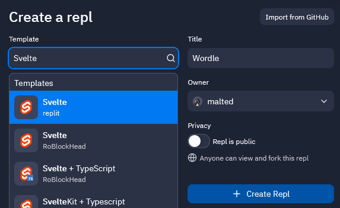
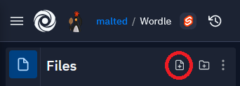
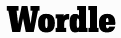
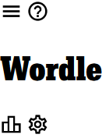
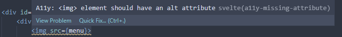
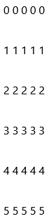
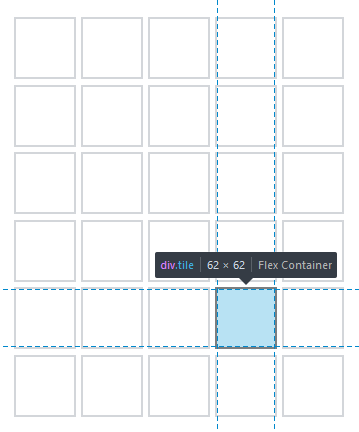

# Making A Wordle Clone In Svelte

## Introduction

This tutorial will cover concept such as; responsiveness; Svelte's `each` and `if` blocks and stores; CSS variables, at-rules, and font imports; and deploying your game for everyone to play.

### Svelte

[Svelte](https://svelte.dev) is a javascript framework for building interactive user interfaces. This tutorial assumes a basic understanding of the basics of Svelte; if you don't know how amazing it is yet I strongly recommend working through the [official, interactive tutorial](https://svelte.dev/tutorial).

### Wordle

[Wordle](https://nytimes.com/games/wordle/index.html) is a game in which you have to guess a five-letter word in six attempts.

Each time you guess, you're told which of your chosen letters are in the target word, and whether they are in the right place.

-   If a letter is colored gray, it means that letter does not appear in the target word.
-   If a letter is colored yellow, it means that letter _does_ appear in the target word, but it is in the wrong place.
-   If a letter is colored green, it means that letter appears in the target word and is in the correct position.

If you find the five green letters and make a word, then you've won Wordle for the day!

## Repl Setup

First, we need to create our Repl. Replit has already provided us with some templates for Svelte; let's choose `Svelte` by `replit`. Give your Repl a name, then we're good to go!



## Header

### Setup

Let's start off with our first component: the page's header.
The main role of this is to display the game's name, along with some icon buttons for things like settings and help et cetera.

Create a new component by creating a new file...



...and giving it a name ending with `.svelte`. I have named mine `Header.svelte`. It's convention to name components in CamelCase.

> 📁 For organizational purposes, I'm going to put all of my components in `/src/lib/`.

The standout feature of the header is the game's title. This is super simple to implement: we can simply wrap the text in `h1` tags.

```html
<h1>Wordle</h1>
```

Let's create a `div` container for our header. This will let us add more elements around our title and let us style how the header elements should be arranged around each other.

```html
<div id="header">
	<h1>Wordle</h1>
</div>
```

### Title Font

After The New York Times' acquisition of Wordle, the font of this title has changed. You can get it from [here](https://www.nytimes.com/games/wordle/fonts/karnakcondensed-normal-700.woff2).

> 📁 For organizational purposes, I've put the font in `/src/assets/header/`.

To use it, we first need to import the font. To do this, we will use a CSS at-rule. At-rules are CSS statements that instruct CSS how to behave, as opposed to ones that style markup.

```css
@font-face {
	font-family: Karnak;
	src: url("../assets/header/karnak.woff2") format("woff2");
}
```

Here, `font-family` is the name we give the newly imported font. It could be anything we choose.
Meanwhile, `src` is file that contains the font.

We're using two CSS functions here; `url()` simply points the browser to a file location, while `format()`, as the name suggests, gives the browser a hint on what type of font format said file is. While it's not strictly needed, it's good practice to anyway.

<blockquote>
<details>
<summary><b>Couldn't the browser simply infer the file format from the file name's ending?</b></summary>
No! A file extension is just a part of the file name. It doesn't do anything special by itself. On Windows, this is not obvious as the file extension specifies the program to be used to open the file. This is an example of the operating system abstracting information away from the user. TODO: say how this can be unhelpful in teaching people about files, and how GNU/Linux tends to handle this differently.

To demonstrate this point, I could rename a picture from `font.woff2` to `image.png`. This does not affect the file contents and we could still use it as a font in the same way: `src: url("image.png") format("woff2");`

_TL;DR_ - A file's name does not guarantee the type of information it contains. This is why the `format()` method is useful for specifying the format of the file explicitly.

</details>
</blockquote>
<br>

Now let's use it in our component.

```html
<style>
	h1 {
		font-family: Karnak;
		font-size: 2.3rem;
	}
</style>
```

Which yeilds the following;



Nice. Now that our title is sorted, let's add some other elements to our header.

### Header Buttons

The original game has four buttons; a hamburger icon; a help icon; a leaderboard icon; and a settings icon.

Let's add them in now, then at the end of the tutorial we will make them functional.

First, let's get some icons. I like the ones on the [Google Icons](https://fonts.google.com/icons) site.

-   [Hamburger](https://fonts.google.com/icons?selected=Material%20Icons%20Outlined%3Amenu%3A)
-   [Help](https://fonts.google.com/icons?selected=Material%20Icons%20Outlined%3Ahelp_outline%3A)
-   [Leaderboard](https://fonts.google.com/icons?selected=Material%20Icons%20Outlined%3Aleaderboard%3A)
-   [Settings](https://fonts.google.com/icons?selected=Material%20Icons%20Outlined%3Asettings%3A)

> 📁 For organizational purposes, I've put all of these icons in `/src/assets/header/icons/`

Now we need to import them into our component. In Svelte, we don't put the paths in our `img` tags, rather we import them in our `script` tags, like so;

```html
<script>
	import help from "../assets/header/icons/help.svg";
	import menu from "../assets/header/icons/menu.svg";
	import settings from "../assets/header/icons/settings.svg";
	import leaderboard from "../assets/header/icons/leaderboard.svg";
</script>
```

Now, when adding our images, we can simply supply the value of the `src` properties as we would with any other JS variable in Svelte;

```html
 // TODO: Remove quotes >:( prettier is dumb

<!-- etc -->
```

The icons should be arranged in groups of two, either side of the title. Let's do that in the HTML as well.

```html
<div id="header">
	<div class="menu">
		 // TODO: remove quotes
		
	</div>
	<h1>Wordle</h1>
	<div class="menu">
		 // TODO: remove quotes
		
	</div>
</div>
```

This outputs the following;



Ah. Let's fix that. Nothing a flexbox can't fix!

```css
#header {
	display: flex;
	flex-direction: row;
	justify-content: space-between;
	align-items: center;
}
```

We can also make it look a bit nicer by adding a border at the bottom, setting the height, and adding some padding at the sides, like so:

```css
#header {
	/* ... */
	border-bottom: 1px solid lightgrey;
	height: 3.1rem;
	padding: 0 1rem;
}
```

Those buttons are looking a little snug - let's space them out a bit. To do this we can simply add some padding to the icons.

```css
.menu > img {
	padding: 0.25rem;
}
```

With our finished CSS, our header looks like this;


> **Looking good!**

To finish up with our header component, we should add some alt text to the icons.
Alt text is a description of the image, which is used by screen readers to describe the image.

> **This is another reason why Svelte is awesome. If you're using a normal IDE such as VSCode, Svelte will warn you when you do not add alt text to images. (Unfortunately Replit doesn't have such warnings...yet!)** 

We can do this by simply adding `alt` attributes to the images.

```html
<div id="header">
	<div class="menu">
		//TODO: remove quotes
		
	</div>
	<h1>Wordle</h1>
	<div class="menu">
		//TODO: remove quotes
		
	</div>
</div>
```

## Grid

The grid is where our guessed words will appear in the game. In the original game, it is a table consisting of five columns, and six rows.

Let's make a new component for our grid in `/src/lib/`, called `Grid.svelte`, and add it to our app.

```html
<script>
	import Header from "./lib/Header.svelte";
	import Grid from "./lib/Grid.svelte";
</script>

<main>
	<header />
	TODO: Capitalise >:( prettier is dumb
	<Grid />
</main>

<!-- ... -->
```

Alright. First, let's specify the grid's height and width.

```html
<script>
	const rowLength = 5;
	const rowNum = 6;
</script>
```

Then, we can use them in generating our grid.
We're going to use a `table` tag for our main grid, use `tr` (table row) tags for each row, and `td` (table data) tags for each tile.

Originally, I was using a CSS grid of `div`s, but I found that it was more complex than this method. Additionally, using table elements makes our grid much more semantic!

<blockquote>
<details>
<summary><b>What are HTML semantics?</b></summary>
Semantically valid HTML helps screen readers, search engines, and other user devices decide the context and significance of web content.

To effectively represent content meaning, developers choose appropriate HTML elements regarding the intrinsic meaning of a web page rather than how they appear visually.

Examples of non-semantic elements include;

-   `<div>`
-   `<span>`

These tell us nothing about their content.

Meanwhile, examples of semantic elements include;

-   `<form>`
-   `<article>`
-   `<table>`

These clearly define their content.

###### Source: elementor.com, w3schools.com

</details>
</blockquote>
<br>

We want our grid to resemble something like this;

```html
<table>
	<tr>
		<td>
			<p>
				<!-- This is where the letter in the tile will go -->
			</p>
		</td>

		<!-- Repeat four more times -->
	</tr>

	<!-- Repeat five more times -->
</table>
```

Implementing this is actually pretty simple in Svelte. We can simply use the `{each}` block to iterate over our grid.

First, we need to create the rows. We want 6 of them, as we have already specifed in our `rowNum` variable.

Numbers themselves are not iterable in Javascript, so in order to be able to use them in our `{each}` block, we need to make them iterable.
To do this, we can make an array the same length as our `rowNum` variable. This is easy to do.

The `Array` constructor can take a number as an argument, and will create an array of that length. A quirk of Javascript means that this new array is populated with empty slots, not slots with actual `undefined` values. Since we only want an iterable of a set length, and don't care about what the values are, we can just use `Array(rowNum)`.

In our `{#each}` loop, we would also usually define a variable to hold the current value of the current loop. In our case, it would just be an empty array slot, so we can discard it by naming the variable `_`.

Finally, we can access the current index of the loop by providing a variable name as a second argument to the `{#each}` block. In this case, let's name it `row`. On the first iteration, `row` will be `0`, on the second iteration, `row` will be `1`, and so on, until the end of our array.

Let's add our rows to our grid.

```html
<table>
	{#each Array(rowNum) as _, row}
	<tr></tr>
	{/each}
</table>
```

This outputs the following;

```html
<table>
	<tr></tr>
	<tr></tr>
	<tr></tr>
	<tr></tr>
	<tr></tr>
	<tr></tr>
</table>
```

The `tr` element has been repeated six times because our `rowNum` variable is six.

Now we can add the tiles to our rows in the same manner.

```html
<table>
	{#each Array(rowNum) as _, row}
	<tr>
		{#each Array(rowLength) as _, col}
		<td></td>
		{/each}
	</tr>
	{/each}
</table>
```

Cool. Now we have our grid.
In order to display the letters inside the tiles, however, we should add a `p` element to each tile, so we have more control over the styling of the letters.

While developing the game, let's display the row all the tiles are on, as well, to make sure it's working as expected.

```html
<!-- ... -->
<td>
	<p>{row}</p>
</td>
<!-- ... -->
```

Which outputs the following;



The row numbers are there, but it still looks nothing like a Wordle grid. Let's analyse the orignal game's grid to see what we need to change in ours.



In this screenshot I have enabled the browser devtools to view the tile dimensions.

Firstly—and perhaps most obviously—the grid tiles have a gray outline on their borders. The tiles themselves are square, measuring 62 pixels squared. The tiles have a

This is equivalent to 3.875 rem.

// TODO: add dropdown
Why is <code>rem</code> better than <code>px</code>?

User preferences are respected
You can change the apparent px value of rem to whatever you'd like

## Keyboard

Let's make a new component in `/src/lib/`, called `Keyboard.svelte`.
First, we need to define the letters that each key will contain. I'm going to make an array containing three arrays; one for each row of the keyboard.

```js
const rows = [
	["q", "w", "e", "r", "t", "y", "u", "i", "o", "p"],
	["a", "s", "d", "f", "g", "h", "j", "k", "l"],
	["enter", "z", "x", "c", "v", "b", "n", "m", "backspace"],
];
```

Next, we are going to construct the HTML. Instances like this is when the power of Svelte becomes clear. We're going to generate the HTML using Svelte's `{#each}` block.

```html
<div id="keyboard">
	{#each rows as row}
	<div class="row">
		{#each row as key}
		<button>{key}</button>
		{/each}
	</div>
	{/each}
</div>
```

Here, `row` will be the array in `rows` we are currently on, and `key` will be the current value in `row`.

This will cause our component to look like this:


Let's improve that backspace key. I think a backspace icon would work better in place of the word "backspace".
I found one I liked on [Google Icons](https://fonts.google.com/icons?icon.query=backspace).
Download it, then drag the file into the `Files` panel in Replit.

> 📁 For organizational purposes, I've put this icon in `/src/assets/keyboard/`.

Alright! Let's implement it into our keyboard.

First, import the image into the component:

```js
import backspace from "../assets/keyboard/backspace.svg";
```

We want to put the SVG into the button which would have contained the text "backspace". Let's do this using Svelte's `{#if}` block, like so:

```html
<button>
	{#if key === "backspace"}
	
	{:else} {key} {/if}
</button>
```

> **I told you Svelte was powerful!**

To get the icon centering correctly in the key, we only need a few lines of CSS. To keep things clean, the value used for the button's `font-size` property and the SVG's `height` have been extracted and used as variables. Let's also explicitly set the keys' font sizes with the same variable.

```css
* {
	--text-size: 1rem;
}
button {
	font-size: var(--text-size);
}
button > img {
	vertical-align: text-bottom;
	height: var(--text-size);
}
```

Now the backspace key is in place, we can style the buttons to make them look like Wordle's. Here we are going to use flexbox, as it's very powerful and enables us to get the results we want easily.

First, let's make the whole keyboard a flexbox. This will allow us to decide what happens to each row on the keyboard.

```css
#keyboard {
	display: flex;
	flex-direction: column;
	max-width: 500px;
}
```

While this won't change how the keyboard looks at the moment, it explicity tells the browser to render each row of the keyboard below the last.
(If you want to learn more about flexbox, CSS-Tricks has a [great cheatsheet](https://css-tricks.com/snippets/css/a-guide-to-flexbox/).)

Next, let's look at each row.
We want the keys to be displayed next to each other, from left to right. This can be achieved by setting the `flex-direction` to `row`, but since that is the default option we don't need to include it in our rule. Centering the row with `justify-content` will place the row in the middle of the keyboard as opposed to squashed up against the left edge.

```css
.row {
	display: flex;
	justify-content: center;
}
```

> **Notice how I have used an ID for the whole keyboard, and a class for the rows? ID's are usually used to refer to single elements, while classes are best used on multiple elements.**

Let's make those buttons look better!

Different operating systems and browsers choose to render default HTML elements - like buttons - differently. Let's remove the default styling on them and make the buttons look the way we want.

```css
button {
	cursor: pointer;
	text-transform: uppercase;
	color: black;
	background-color: lightgrey;
	border: none;
	border-radius: 4px;
	font-size: var(--text-size);
	padding: 0;
}
```

Our keyboard now looks like this:


> **Ok; it's getting better.**

Next let's space things out a bit. The keys are all cramped together - this can be fixed with a simple `margin` on each key. There's also not much space around the letters on each key. While one way to do this would be to introduce a `padding` on the keys, we're going to take a different approach. By leveraging features of flexbox, we can make the keyboard act in a more responsive way across changing screen sizes. Let's add some declarations to the `button` rule we already have.

```css
button {
	/* ... */
	height: 3.5rem;
	text-align: center;
	margin: 0.2rem;
	flex: 1 1 0;
}
```

The most interesting property here is `flex`. It's a 3-in-1 value pack; bundling `flex-grow`, `flex-shrink` and `flex-basis` properties into a single property. The one we are most interested in is `flex-grow`. This makes each item in the flexbox - i.e. each key - grow to take up the available space. Since our rows' `flex-direction`s are set to `row` - as is default - they grow widthways. This lets the keys grow and shrink to fill the space available to them.

> **Try resizing your viewport!**

Our keyboard in its full width:

The same page, with the viewport resized to show the dynamic resizing in action:


> **The concept of reactivity is one of the most important considerations you should have as a web developer. According to data analysis firm Statistica, over half of the internet's traffic in 2021 was from smartphones. By not being mindful of this when developing websites, you could be driving a significant proportion of your users away.**

Our keyboard is looking a bit too ortholinear for my liking. If you count the number of keys on the middle row of your keyboard versus the top, you will find there is one less. Let's account for this in our keyboard by inserting two half-key sized spaces at either end of the row to make up a whole key's width.
We are doing this for two reasons;

-   To push the keys on the second row inwards, more accurately mirroring a real world keyboard.
-   To introduce an extra key's worth of space to make the middle row keys the same width as the top row keys.

To do this, we are going to insert a div before the "a" key, and one after the "l" key. Then, we can give them a width of half a normal key.

```html
<!-- ... -->
{#each row as key} {#if key === "a"}
<div class="half"></div>
{/if}
<button>
	{#if key === "backspace"}
	
	{:else} {key} {/if}
</button>
{#if key === "l"}
<div class="half"></div>
{/if} {/each}
<!-- ... -->
```

Let's specify the rule in our CSS:

```css
.half {
	flex-grow: 0.5;
}
```

Good news! We are ever so nearly done. All that's left is to make the enter and backspace keys the correct width.
As they are ✨special✨ keys, they are traditionally 1.5x the width of normal letter keys.
To implement this, we need a way to target them in the CSS. Let's add a utility class to them with a ternary statement.

```html
<button class={key === "enter" || key === "backspace" ? "one-and-a-half" : ""}>
```

If the current key is "enter" or "backspace", the `one-and-a-half` class will be added to the button. If it isn't, the button will remain classless.

Now we can change the width of our special keys. Let's make them grow by 1.5x the amount of the normal keys.

```css
.one-and-a-half {
	flex-grow: 1.5;
}
```

<blockquote>
<details>
<summary><b>Why are some keys bigger than others?</b></summary>
You have a keen eye! Since we have inserted two divs at either end of the row, but we are still applying the same margin as the normal keys, there is an extra keys worth of margin in that row. Luckily, this is a simple fix; just half the margin on these keys.
    
<pre><code>.half {
    flex-grow: .5;
    margin: .1rem;
}
</code></pre>
The same thing is happening with our keys on the bottom row, but in reverse! Instead of halving the margin on our enter and backspace keys, let's increase it by a half.   
<pre><code>.one-and-a-half {
    flex-grow: 1.5;
    margin: .3rem
}
</code></pre>
</details>
</blockquote>
<br>

### A note on touch devices

Navigate to the page on a mobile device. Say you wanted to type a letter twice; the natural thing to do would be to double tap on the corresponding button, right? Although you are wanting this to mean 2 separate taps in quick succession, most mobile browsers will interpret this as a _zoom in_ gesture.

Because it is very unlikely that a user who double taps a key is wanting to zoom in, let's disable this feature.

On our main keyboard CSS rule, let's add the following line;

```css
#keyboard {
	/* ... */
	touch-action: manipulation;
}
```

### Closing thoughts - dynamic measurements

Alright. Our keyboard is looking awesome! But - hang on. I have decided that I don't like the size of the text inside the buttons. Seems like a simple fix to change it, right? One would think it would be as simple as changing the `font-size` property on our `button` rule.

However, now that we have made that change, other values that we have decided on based on that font size now look disproportionate. The two that stick out to me the most are the filler divs' margins, and the backspace icon's height. Let's change that.

First, let's define a variable so we can use it in any rule in our component.

```css
* {
	--text-size: 0.8rem;
	--key-margin: 0.2rem;
}
```

Next, let's replace our `button`'s margin with this variable.

```css
button {
	/* ... */
	margin: var(--key-margin);
}
```

Finally, we can introduce our dynamic values. We're going to use CSS' powerful `calc` method.

```css
.half {
	/* ... */
	margin: calc(var(--key-margin) * 0.5);
}
.one-and-a-half {
	/* ... */
	margin: calc(var(--key-margin) * 1.5);
}
button > img {
	/* ... */
	height: calc(var(--text-size) * 1.5);
}
```

We don't want to push down our larger buttons though. Not only are we increasing their horizontal margin, we're increasing their vertical one too. We want the vertical margin to stay the same.

To do this, we can simply set the left and right margins to our calculated value. The top and bottom margins will cascade down from our button rule, and stay as the value of `--key-margin`.

```css
.one-and-a-half {
	margin-left: calc(var(--key-margin) * 1.5);
	margin-right: calc(var(--key-margin) * 1.5);
}
```

One more thing. Too avoid repeating ourselves and to make it more obious which valuemeans what, we can extract our multiplicand values to a local variable. Our full rules for `.half` and `.one-and-a-half` will now look like this:

```css
.half {
	--grow-value: 0.5;
	flex-grow: var(--grow-value);
	margin: calc(var(--key-margin) * var(--grow-value));
}
.one-and-a-half {
	--grow-value: 1.5;
	flex-grow: var(--grow-value);
	margin-left: calc(var(--key-margin) * var(--grow-value));
	margin-right: calc(var(--key-margin) * var(--grow-value));
}
```


Perfect!

### Final result

Our keyboard:


Wordle keyboard:


I would say that's looking pretty spot on!

Later on, we will be expanding on this keyboard, and making it better than the one in the original game, using features like CSS _pseudo-classes_, and Svelte's `motion` library.
